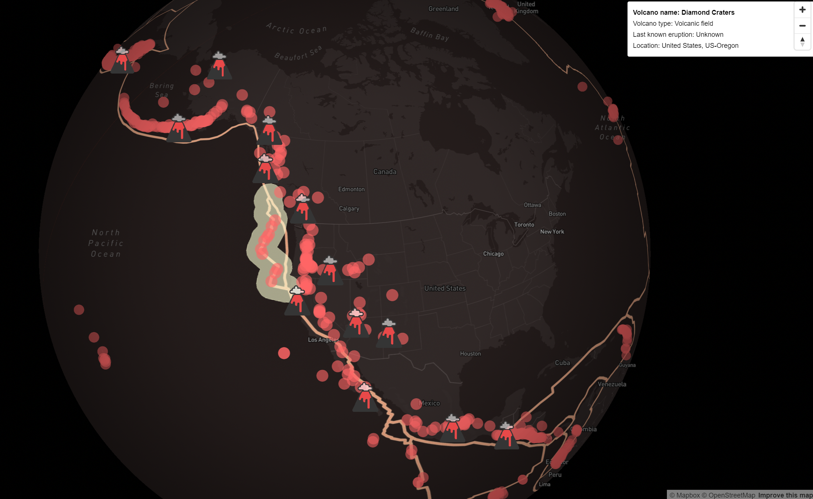

# Global Volcano Map

For this map I wanted to make some improvements on where I left off with my map from Lab 1. As this assignment was to test our skills in mapping a different dataset and create something new and novel, I chose a global volcano dataset as the point features and plate tectonic boundaries allowed me to expand on the same types of interactivity I would like to implement into the Squamish Culturally Important Plants map from Lab 1. 

This map was a huge learning curve. I started the map by displaying the volcanoes as a point layer with a map overlay in the top right corner with useful and interesting information on the volcanoes the mouse hovers over. I then added a highlighting feature to the volcanoes, where all of the volcanoes of the same volcano type are highlighted on the map as the viewer mouses over the volcano point. As useful as this information was, I found it a little underwhelming simply seeing the points highlighted and didn’t feel that it contributed much to the reader's engagement with the data. I then decided to find a way to gamify the map by adding more attractive visuals. This developed into the volcano icons that hover the map as you mouse over the feature. I additionally added the plate tectonic boundaries as they relate to volcano formation. 

As a geographer, I didn’t just want to show the locations of the volcanoes and attribute them with information. Maps are mediums for storytelling, and simply displaying the data didn’t achieve this. To help the reader draw connections between the plate tectonics and the volcanoes, I added a buffer feature, where the map viewer can click on a plate tectonic boundary and it will draw a 200km buffer around the boundary. This feature shows the reader how the tectonic boundaries and volcanoes are spatially correlated and develop an underlying story of how the volcanoes formed. 

The base map has minimal styling as it serves primarily as a general overview of where larger geographic units such as countries and continents are. I did however keep the road names, cities, and other smaller geographic unit labels at smaller zoom levels in case there were volcanoes located within cities so that people could explore how the urban landscape evolved around the volcano. The colors of the whole map are symbolic of volcanic ash and lava, which may be a bit cliche however I wanted to stay on brand with the volcano theme. 

Overall I was quite happy with these effects, and the title page really brought everything together as it explained. This map goes beyond showing the locations of volcanoes and providing data, it tells a story of how many of the volcanoes around the world developed

For this map, there are areas that I would like to make some improvements on. To start, in the html file is unfinished code for a script that highlights all of the volcanoes that fall within the buffered layer. Finishing this code would add interactivity that I believe would help the reader draw the connection between the buffer layer and the volcano points later. In the future, I would also like there to be different volcano icons that represent each type of volcano as the viewer mouses over the volcano feature on the map. I believe this would take the map to the next level, as the reader could hover over a cinder cone and see what a cinder cone looks like, and then hover over a stratovolcano and compare the two icons to gain an understanding of what the volcano types truly mean without having to develop a complex geomorphic background on the topic. Additionally, the popup for the plate tectonic labels is a little annoying because it shows up whenever you lick the map since the plate tectonics cover the entire globe. This feature should likely be changed altogether, potentially adding simple label names to the tectonic plates or showing their labels on mouseover. I don’t really have a vision for the plate labels yet but am very open to suggestions!

Coding resources:
Mapbox tutorials - these were extremely useful for highlighting different layers, applying filters, displaying popups and really the meat and potatoes of my project
Turf.js for the buffer
W3Schools - for CSS styling, especially useful for the intro card
Chat GPT - very useful for searching up coding error messages I would get in my console

The map:
https://cnorton27.github.io/volcanoes_map/volcanoes_map.html

Global Volcano Map: 

